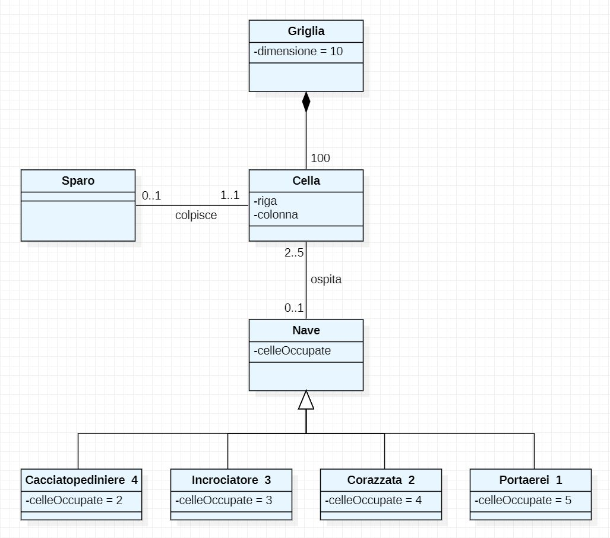

# Report

## Indice

1. Introduzione

2. Modello di dominio

3. Requisiti specifici
   
   - 3.1 Requisiti funzionali
   
   - 3.2 Requisiti non funzionali

7. Manuale utente

9. Analisi retrospettiva

   - 9.1 Sprint 0
			
			
			
## 1. Introduzione

Il progetto prevede la creazione del gioco: "***Battaglia Navale***". 

La *Battaglia Navale* è un gioco da tavolo per due contendenti. In questo gioco ognuno dei due avversari possiede una griglia, generalmente rappresentata come una matrice quadrata. La griglia conterrà due assi cartesiani: ascisse e ordinate, rappresentate rispettivamente da numeri e lettere. 

All'interno del "*campo di battaglia*" i due giocatori potranno posizionare delle navi che occuperanno un certo numero di caselle. Le navi potranno essere disposte esclusivamente secondo l'asse delle ascisse oppure quello delle ordinate (**mai** in diagonale).

Lo scopo di ognuno dei due giocatori sarà quello di affondare quante più navi possibili in un lasso di tempo. 

    

Il programma oggetto della relazione, invece, prevede la realizzazione di una "*variante*" del gioco, dove l'unica figura giocante è l'utente, che dovrà indovinare e affondare le navi che si trovano in posizioni randomiche, decise dal computer.

La durata della partita potrà essere dettata dal numero di tentavi a disposizione dell'utente. Il livello della difficoltà della partita determina il numero di tentativi.  

    

## 2. Modello di dominio

Di seguito si riporta il diagramma UML che, secondo prospettiva concettuale, descrive il ***dominio*** del gioco *Battaglia Navale*.




## 3. Requisiti specifici

### 3.1 Requisiti funzionali

**Come giocatore voglio mostrare l'help con elenco comandi**

*Criteri di accettazione*

Al comando **/help** o invocando l'app con flag **--help** o **-h** 

il risultato è una descrizione concisa, che normalmente appare all'avvio del programma, seguita dalla lista di comandi disponibili, uno per riga, come da esempio successivo:

- gioca
- esci
- ...

    

**Come giocatore voglio chiudere il gioco**

*Criteri di accettazione* 

Al comando **/esci** 

l'applicazione chiede conferma:

- se la conferma è positiva, l'applicazione si chiude restituendo il controllo al
  sistema operativo.

- se la conferma è negativa, l'applicazione si predispone a ricevere nuovi tentativi o
  comandi. 

                    

**Come giocatore voglio impostare il livello di gioco per variare il numero massimo di tentativi sbagliati**

*Criteri di accettazione*

- Al comando **/facile**
  
  l’applicazione risponde con OK e imposta a 50 il numero massimo di tentativi falliti.

- Al comando **/media**
  
  l’applicazione risponde con OK e imposta a 30 il numero massimo di tentativi falliti.

- Al comando **/difficile**
  
  l’applicazione risponde con OK e imposta a 10 il numero massimo di tentativi falliti. 

    

**Come giocatore voglio mostrare il livello di gioco e il numero di massimo di tentativi falliti**

*Criteri di accettazione*

Al comando **/mostralivello**

l’applicazione risponde visualizzando il livello di gioco e il numero di massimo di tentativi falliti.

    

**Come giocatore voglio mostrare i tipi di nave e il numero**

*Criteri di accettazione*

Al comando **/mostranavi** 

l’applicazione risponde visualizzando, per ogni tipo di nave, la dimensione in quadrati e il numero di esemplari da affondare:

| Tipo nave           | Dimensione | Numero esemplari |
| ------------------- | ---------- |:----------------:|
| *Cacciatopediniere* | ⊠⊠         | 4                |
| *Incrociatore*      | ⊠⊠⊠        | 3                |
| *Corazzata*         | ⊠⊠⊠⊠       | 2                |
| *Portaerei*         | ⊠⊠⊠⊠⊠      | 1                |

    

**Come giocatore voglio iniziare una nuova partita**

Al comando **/gioca** 

se nessuna partita è in corso l'applicazione imposta causalmente le navi, in orizzontale o in verticale, mostra la griglia vuota e si predispone a ricevere il primo tentativo o altri comandi.

    

**Come giocatore voglio svelare la griglia con le navi posizionate**

Al comando **/svelagriglia**

l’applicazione risponde visualizzando, una griglia 10x10, con le righe numerate da 1 a 10 e le colonne numerate da A a J, e tutte le navi posizionate

    

### 3.2 Requisiti non funzionali

**RNF1**: 
il container docker dell’app deve essere eseguito da terminali che supportano Unicode con encoding UTF-8 o UTF-16. 


**Elenco di terminali supportati** 
Linux:

- terminal

Windows:

- Powershell

- Git Bash (in questo caso il comando Docker ha come prefisso winpty; es: winpty docker -it ....)

**Comando per l’esecuzione del container** 
Dopo aver eseguito il comando docker pull copiandolo da GitHub Packages, Il comando Docker da usare per eseguire il container contenente l’applicazione è:

```bash
docker run --rm -it ghcr.io/softeng2223-inf-uniba/battleship-base2223:latest
```

dove *base2223* sarà sostitituito con il nome del gruppo.