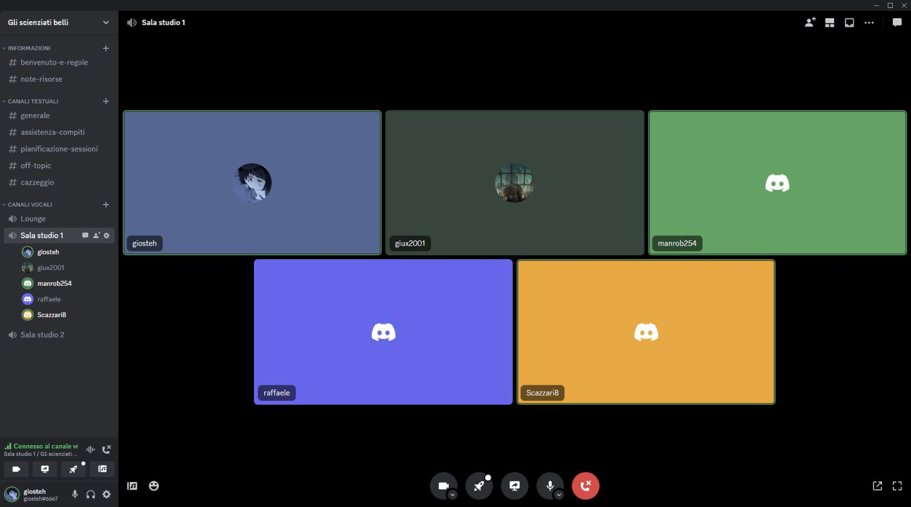

# Report

## Indice

1. Introduzione

2. Modello di dominio

3. Requisiti specifici
   
   - 3.1 Requisiti funzionali
   
   - 3.2 Requisiti non funzionali

7. Manuale utente

8. Processo di sviluppo e organizzazione del lavoro

9. Analisi retrospettiva

   - 9.1 Sprint 0
			
			
			
## 1. Introduzione

Il progetto prevede la creazione del gioco: "***Battaglia Navale***". 

La *Battaglia Navale* è un gioco da tavolo per due contendenti. In questo gioco ognuno dei due avversari possiede una griglia, generalmente rappresentata come una matrice quadrata. La griglia conterrà due assi cartesiani: ascisse e ordinate, rappresentate rispettivamente da numeri e lettere. 

All'interno del "*campo di battaglia*" i due giocatori potranno posizionare delle navi che occuperanno un certo numero di caselle. Le navi potranno essere disposte esclusivamente secondo l'asse delle ascisse oppure quello delle ordinate (**mai** in diagonale).

Lo scopo di ognuno dei due giocatori sarà quello di affondare quante più navi possibili in un lasso di tempo. 

    

Il programma oggetto della relazione, invece, prevede la realizzazione di una "*variante*" del gioco, dove l'unica figura giocante è l'utente, che dovrà indovinare e affondare le navi che si trovano in posizioni randomiche, decise dal computer.

La durata della partita potrà essere dettata dal numero di tentavi a disposizione dell'utente. Il livello della difficoltà della partita determina il numero di tentativi.  

    

## 2. Modello di dominio

Di seguito si riporta il diagramma UML che, secondo prospettiva concettuale, descrive il ***dominio*** del gioco *Battaglia Navale*.


## 3. Requisiti specifici

### 3.1 Requisiti funzionali

**RF1: Come giocatore voglio mostrare l'help con elenco comandi**

*Criteri di accettazione*

Al comando **/help** o invocando l'app con flag **--help** o **-h** 

il risultato è una descrizione concisa, che normalmente appare all'avvio del programma, seguita dalla lista di comandi disponibili, uno per riga, come da esempio successivo:

- gioca
- esci
- ...

    

**RF2: Come giocatore voglio chiudere il gioco**

*Criteri di accettazione* 

Al comando **/esci** 

l'applicazione chiede conferma:

- se la conferma è positiva, l'applicazione si chiude restituendo il controllo al
  sistema operativo.

- se la conferma è negativa, l'applicazione si predispone a ricevere nuovi tentativi o
  comandi. 

                    

**RF3: Come giocatore voglio impostare il livello di gioco per variare il numero massimo di tentativi sbagliati**

*Criteri di accettazione*

- Al comando **/facile**
  
  l’applicazione risponde con OK e imposta a 50 il numero massimo di tentativi falliti.

- Al comando **/media**
  
  l’applicazione risponde con OK e imposta a 30 il numero massimo di tentativi falliti.

- Al comando **/difficile**
  
  l’applicazione risponde con OK e imposta a 10 il numero massimo di tentativi falliti. 

    

**RF4: Come giocatore voglio mostrare il livello di gioco e il numero di massimo di tentativi falliti**

*Criteri di accettazione*

Al comando **/mostralivello**

l’applicazione risponde visualizzando il livello di gioco e il numero di massimo di tentativi falliti.

    

**RF5: Come giocatore voglio mostrare i tipi di nave e il numero**

*Criteri di accettazione*

Al comando **/mostranavi** 

l’applicazione risponde visualizzando, per ogni tipo di nave, la dimensione in quadrati e il numero di esemplari da affondare:

| Tipo nave           | Dimensione | Numero esemplari |
| ------------------- | ---------- |:----------------:|
| *Cacciatopediniere* | ⊠⊠         | 4                |
| *Incrociatore*      | ⊠⊠⊠        | 3                |
| *Corazzata*         | ⊠⊠⊠⊠       | 2                |
| *Portaerei*         | ⊠⊠⊠⊠⊠      | 1                |

    

**RF6: Come giocatore voglio iniziare una nuova partita**

*Criteri di accettazione*

Al comando **/gioca** 

se nessuna partita è in corso l'applicazione imposta causalmente le navi, in orizzontale o in verticale, mostra la griglia vuota e si predispone a ricevere il primo tentativo o altri comandi.

    

**RF7: Come giocatore voglio svelare la griglia con le navi posizionate**

*Criteri di accettazione*

Al comando **/svelagriglia**

l’applicazione risponde visualizzando, una griglia 10x10, con le righe numerate da 1 a 10 e le colonne numerate da A a J, e tutte le navi posizionate

                    

**RF8: Come giocatore voglio impostare il numero massimo di tentativi falliti per livello di gioco**

*Criteri di accettazione*

- Al comando **/facile** *numero*

  l'applicazione risponde con OK e imposta a *numero* il numero massimo di tentativi falliti

- Al comando **/medio** *numero*

  l'applicazione risponde con OK e imposta a *numero* il numero massimo di tentativi falliti

- Al comando **/difficile** *numero*

  l'applicazione risponde con OK e imposta a *numero* il numero massimo di tentativi falliti

                    

**RF9: Come giocatore voglio impostare direttamente il numero massimo di tentativi che si possono fallire**

*Criteri di accettazione*

Al comando **/tentativi** *numero*

l’applicazione risponde con OK e imposta a *numero* il numero massimo di tentativi falliti

                    

**RF10: Come giocatore voglio impostare la taglia della griglia**

*Criteri di accettazione*

- Al comando **/standard**

  l’applicazione risponde con OK e imposta a 10x10 la dimensione della griglia (è il default)

- Al comando **/large**

  l’applicazione risponde con OK e imposta a 18x18 la dimensione della griglia

- Al comando **/extralarge**

  l’applicazione risponde con OK e imposta a 26x26 la dimensione della griglia

                    

**RF11: Come giocatore voglio impostare il tempo di gioco**

*Criteri di accettazione*

Al comando **/tempo** *numero*

l'applicazione risponde con OK e imposta a *numero* il numero di minuti a disposizione per giocare

                    

**RF12: Come giocatore voglio mostrare il tempo di gioco**

*Criteri di accettazione*

Al comando **/mostratempo**

l'applicazione risponde visualizzando il numero di minuti trascorsi nel gioco e il numero di minuti ancora disponibili

                    

**RF13: Come giocatore voglio effettuare un tentativo per colpire la nave**

*Criteri di accettazione*

Digitando una coppia di caratteri separati da un trattino, corrispondenti rispettivamente al numero di riga e alla lettera della colonna, (es. B-4), l’applicazione risponde 

- “acqua” se sulla cella non è posizionata nessuna nave;
- "colpito" se sulla cella è posizionata una nave;
- "colpito e affondato" se sulla cella è posizionata una nave ed è l’ultima cella non colpita della nave. 

Qualunque sia l’esito del tentativo, l’applicazione mostra la griglia con le navi colpite parzialmente o affondate, il numero di tentativi già effettuati, e il tempo trascorso.

La partita termina con successo se il tentativo ha affondato l’ultima nave.

La partita termina con insuccesso se è stato raggiunto il numero massimo di tentativi falliti o se è scaduto il tempo di gioco

                    

**RF14: Come giocatore voglio mostrare la griglia con le navi colpite e affondate**

*Criteri di accettazione*

Al comando **/mostragriglia**

l'applicazione risponde visualizzando una griglia con le righe numerate a partire da 1 e le colonne a partire da A, con le navi affondate e le sole parti già colpite delle navi non affondate

                    

**RF15: Come giocatore voglio mostrare il numero di tentativi già effettuati e il numero di tentativi falliti**

*Criteri di accettazione*

Al comando **/mostratentativi**

l'applicazione risponde visualizzando il numero di tentativi già effettuati, il numero di tentativi falliti e il numero massimo di tentativi falliti

                    

**RF16: Come giocatore voglio abbandonare una partita**

*Criteri di accettazione*

Al comando **/abbandona**

l'applicazione chiede conferma

- se la conferma è positiva, l'applicazione risponde visualizzando sulla griglia la posizione di tutte le navi e si predispone a ricevere nuovi comandi
- se la conferma è negativa, l'applicazione si predispone a ricevere nuovi tentativi o comandi

                    

### 3.2 Requisiti non funzionali

**RNF1**: 
il container docker dell’app deve essere eseguito da terminali che supportano Unicode con encoding UTF-8 o UTF-16. 


**Elenco di terminali supportati** 
Linux:

- terminal

Windows:

- Powershell

- Git Bash (in questo caso il comando Docker ha come prefisso winpty; es: winpty docker -it ....)

**Comando per l’esecuzione del container** 
Dopo aver eseguito il comando docker pull copiandolo da GitHub Packages, Il comando Docker da usare per eseguire il container contenente l’applicazione è:

```bash
docker run --rm -it ghcr.io/softeng2223-inf-uniba/battleship-base2223:latest
```

dove *base2223* sarà sostitituito con il nome del gruppo.


## 7. Manuale utente

**Descrizione del gioco**:

Il gioco della battaglia navale prevede la generazione di una griglia 10 x 10, all'interno della quale saranno posizionate 10 navi. 

L'obiettivo del gioco è quello di trovarle e affondarle, indicando ad ogni turno le coordinate della cella che vorrai colpire. 

In base al livello scelto avrai un numero massimo di tentativi che potrai fallire. Potrai scegliere tra i seguenti livelli: facile, medio e difficile.

Se riuscirai ad affondarle tutte, avrai vinto la partita. 

Mi raccomando! Le coordinate devono essere espresse nella forma: [colonna][riga] 
(dove le colonne sono inidicate dalle lettere dalla A alla J, e le righe dai numeri da 1 a 10).
        

        
**Comandi disponibili**:

Di seguito ti lascio una lista dei comandi che potrai utilizzare:

- /help : per visualizzare questo manuale durante il gioco

- /gioca : per avviare una nuova partita 

- /esci : per uscire dal gioco

- /facile : per impostare il livello della partita a facile (MAX 50 tentativi falliti)

- /medio : per impostare il livello della partita a media (MAX 30 tentativi falliti)

- /difficile : per impostare il livello della partita a difficile (MAX 10 tentativi falliti)

- /mostralivello : per mostrare il livello di difficoltà impostato 

- /mostranavi : per mostrare il tipo, la dimensione e il numero delle navi che devi ancora affondare

- /svelagriglia : per mostrare la griglia e tutte le navi posizionate


## 8. Processo di sviluppo e organizzazione del lavoro

- ### **Processo di sviluppo**
  
  Si è adottato lo stile di processo di sviluppo <code>iterativo</code>, secondo il modello `Scrum` che prevede l'applicazione del modello a cascata, in modo iterativo, dove ogni ciclo corrisponde ad una nuova e aggiornata release del programma. 
  
  Ognuna delle iterazioni equivale ad uno `Sprint Backlog` (che nel nostro caso corrispondono a tre), ciascuno dei quali possiede uno `Sprint Goal`, come obiettivo finale. 
  
          

- ### **Comunicazione adottata**
  
  Si è scelto di adottare come mezzo di comunicazione la piattaforma Discord, utilizzata ogni qual volta il gruppo non sia riuscito a riunirsi in presenza. 
  
  La piattaforma, infatti, risulta comoda per la comunicazione, poiché consente un'interazione veloce tra i partecipanti del team. Utile, anche, la possibilità di usufruire di alcuni strumenti offerti da Discord, come la condivisione simultanea del proprio schermo all'intero team.
  
  L'alternativa alla piattaforma di chat, nonché quella più utilizzata dal team, è stata la quotidiana possibilità di ritrovarsi di persona, cercando di rispettare i principi dello sviluppo agile di un software, svolgendo una serie di `Scrum meetings` giornalieri e discutendo ogni modifica apportata durante lo sviluppo del software.

  

        

- ### **Scrum meetings**
  
  La prerogativa del team è sempre stata quella di presenziare le riunioni.
  
  Ogni giorno il gruppo ha deciso se incontrarsi anche il seguente, altrimenti si è programmato un orario, nel quale il gruppo si sarebbe potuto incontrare sulla piattaforma Discord.
  
  Ogni comunicazione di servizio è stata fatta, all'interno di un gruppo di chat testuale ossia Whatsapp. 
  
  Come esplicato anche nella teoria sullo sviluppo del software, durante ogni Scrum meeting, il gruppo è sempre riuscito a ritagliarsi dei momenti di relax, di scambio reciproco di idee e possibili altre implementazioni da aggiungere all'interno del software.
  
          

- ### **WorkFlow utilizzato**
  
  È stato adottato il ****GitHub Flow****, composto dalle seguenti fasi:  

- #### Creazione di un nuovo branch
  
  In questa fase, viene creato un nuovo `branch`, copia del `branch Master`, a sua volta copia locale del repository in remoto.
  
  Il branch creato è stato utilizzato dai membri del team per apportare le diverse modifiche pertinenti le `user story` relative ai diversi Sprint.  

- #### Aggiunta di commit
  
  Ogni modifica apportata all'interno del branch locale è stata, in un primo momento, aggiunta alla `Staging Area`, e in seguito, sempre accompagnato da una breve descrizione significativa ed esplicativa circa la modifica appena apportata, si è eseguito il `commit`.
  
  Tramite quest'ultimo si è reso possibile tracciare le diverse modifiche, rappresentate dai vari commit e apportate al software.

- #### Apertura di una Pull Request
  
  Dopo aver effettuato i diversi commit si procede all'azione di `push` sul repository in remoto, all'interno della piattaforma GitHub. Quest'azione permette l'apertura di una `Pull Request`, ovvero una "proposta" di accettazione da parte dei componenti del team in merito ai cambiamenti apportati da un membro.

- #### Discussione e Valutazione
  
  Durante questa fase ogni componente del gruppo ha il compito di revisionare i diversi commit ed eventualmente di lasciare dei commenti che possono suggerire ulteriori modifiche, permettendo così una vera e propria interazione tra i componenti del team.
  
  Dopo l'approvazione collettiva del team si procede al `Merging` e all'eliminazione del branch remoto.

- #### Merging e Deployment
  
  In quest'ultima fase del workflow, dopo aver effettuato il merging sul Branch Master, qualora non si siano presentati eventuali conflitti (circa, ad esempio, la compilazione dell'analizzatore statico) si è proceduto all'eliminazione del branch remoto all'interno del repository di GitHub.
  Durante le riunioni giornaliere si è sempre utilizzato il workflow esplicato in questo elenco, attenendosi all'applicazione delle `Best Practices`, come ad esempio il pull sulla repository locale contestualmente al merging sul repository remoto. 

- ## Suddivisione dei compiti
  
  Durante lo sviluppo si è cercato di ripartire i diversi task fra i componenti del gruppo nella maniera più equa, considerando che tutte le modifiche sono state seguite pedissequamente da ogni componente del team. 
  
  Successivamente alla presentazione di ogni nuovo Sprint, è stato organizzato un `daily meeting` in cui si è discusso delle nuove user story da implementare. 
  
  Le user story dalla logica più complessa sono state assegnate a più persone. Ogni componente del gruppo ha seguito le diverse modifiche da apportare e ha suggerito, eventualmente, modi per evadere la user story in sviluppo.
  
  Le user story dalla complessità più bassa sono state assegnate ad un solo membro del gruppo.  
  
          

- ## Uso delle boards
  
  È stata utilizzata la possibilità di GitHub di fornire delle `board` integrate in modo da contrassegnare lo stato degli issue, durante il "ciclo vitale".
  La board è composta dalle cards, rappresentate dalle issue, riposte su un totale di cinque colonne:
  
  - ****TO DO**** dove sono state inserite le **issues** appena create, che dovevano essere ancora svolte;
  - ****IN PROGRESS**** dove sono state inserite le **issues** aperte ed in fase di svolgimento.
  - ****REVIEW**** dove sono state collocate le **issues** per le quali è stata aperta una pull request, e che dovevano essere revisionate dai componenti del team;
  - ****READY**** qui sono state spostate le **issues** che aspettano di essere revisionate anche dal docente;
  - ****DONE**** dove verrano spostate le **issues** terminate e ufficialmente chiuse.

È stata creata una project board generale (all'interno della quale si trovano tutte le user stories) e le seguenti sprint boards:

- Sprint 0
- Sprint 1
- Sprint 2


## 9. Analisi retrospettiva

### 9.1 Sprint 0


### 9.2 Sprint 1


      

Dalla discussione avvenuta in occasione del meeting di retrospettiva relativo allo Sprint 1, sono emerse le seguenti conclusioni.

Se da un lato continueremo a lavorare mantenendo l'efficienza riscontrata fino ad ora, e la disponibilità alla pronta e attenta revisione del lavoro svolto da ciascun componente del team; dall'altro lato ci impegnamo a lavorare ancora meglio: in particolare prestando maggiore attenzione nella redazione e conseguente completamento della relazione tecnica, nell'arricchimento della parte di presentazione grafica dell'applicazione da realizzare.

In ultimo si lavorerà per rendere più produttivi gli incontri in presenza, cercando di sfruttare sempre al meglio il tempo a disposizione durante gli stessi.
      